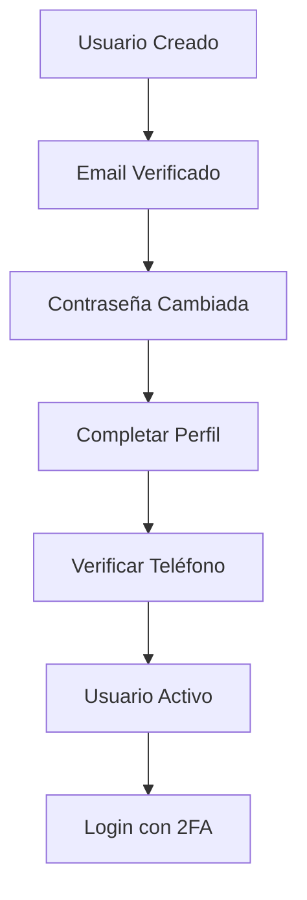

# 🔐 ARQUITECTURA DE AUTENTICACIÓN - NUMERICA

## 🎯 FLUJO COMPLETO DEL USUARIO

### 1️⃣ **REGISTRO INICIAL** (Admin crea usuario)
```
Admin → AWS Cognito → Envía email de verificación → Usuario
```
- Admin crea usuario en Cognito con email temporal
- Usuario recibe email con link de verificación
- Usuario verifica email y se le pide cambiar contraseña

### 2️⃣ **COMPLETAR PERFIL** (Primera vez)
```
Usuario → Completar datos → Verificar teléfono → Activar 2FA
```
- Formulario: Nombre, Apellidos, Teléfono
- Envío de código SMS para verificar teléfono
- Una vez verificado → perfil completo → acceso total

### 3️⃣ **LOGIN DIARIO** (Con 2FA)
```
Usuario → Email/Password → SMS con código → Acceso
```
- Login normal con email/contraseña
- Sistema envía código SMS
- Usuario ingresa código → acceso concedido

## 🔧 COMPONENTES TÉCNICOS

### **FRONTEND (React)**
```
src/components/auth/
├── LoginForm.jsx          # Login principal
├── CompleteProfile.jsx    # Formulario de datos
├── SMSVerification.jsx    # Verificación 2FA  
├── PhoneVerification.jsx  # Verificar teléfono
└── ResetPassword.jsx      # Cambio de contraseña
```

### **BACKEND (API + Lambda)**
```
api/auth/
├── POST /auth/complete-profile     # Guardar datos usuario
├── POST /auth/send-sms-code       # Enviar código SMS
├── POST /auth/verify-sms-code     # Verificar código SMS
├── POST /auth/verify-phone        # Verificar teléfono
└── GET  /auth/user-status         # Estado del perfil
```

### **BASE DE DATOS (PostgreSQL)**
```
Tables:
├── user_profiles              # Datos del usuario
├── sms_verification_codes     # Códigos 2FA temporales
└── pending_logins            # Sesiones pendientes de 2FA
```

### **AWS SERVICES**
```
├── Cognito User Pool          # Autenticación base
├── Lambda Pre-Token Trigger   # Validar 2FA antes de token
├── SNS                       # Envío de SMS
└── RDS PostgreSQL            # Datos adicionales
```

## 🚦 ESTADOS DEL USUARIO



### **Estados posibles:**
- `email_not_verified` - Email pendiente de verificación
- `password_not_changed` - Contraseña temporal activa
- `profile_incomplete` - Falta completar datos personales
- `phone_not_verified` - Teléfono sin verificar
- `active` - Usuario completamente activo
- `suspended` - Usuario suspendido (admin)

## 🔒 MEDIDAS DE SEGURIDAD

### **Nivel 1: Cognito (Base)**
- ✅ Validación de email obligatoria
- ✅ Política de contraseñas robusta
- ✅ Rate limiting de intentos
- ✅ Tokens JWT seguros

### **Nivel 2: 2FA SMS (Intermedio)**  
- ✅ Código de 6 dígitos
- ✅ Expiración en 5 minutos
- ✅ Máximo 3 intentos por código
- ✅ Rate limiting: 1 SMS/minuto por usuario

### **Nivel 3: Validaciones Adicionales (Avanzado)**
- ✅ Validación de formato de teléfono
- ✅ Logging de todos los accesos
- ✅ Detección de patrones sospechosos
- ✅ Cleanup automático de códigos expirados

## 📱 EXPERIENCIA DE USUARIO

### **Primera Vez (Setup):**
1. Recibir email de invitación
2. Verificar email (clic en link)  
3. Cambiar contraseña temporal
4. Completar perfil (nombre, apellidos, teléfono)
5. Verificar teléfono con SMS
6. ¡Listo para usar!

### **Uso Diario:**
1. Login con email/contraseña
2. Recibir SMS con código
3. Ingresar código de 6 dígitos
4. Acceso concedido

## 🔧 CONFIGURACIÓN DE ADMIN

### **Crear Nuevo Usuario:**
```bash
aws cognito-idp admin-create-user \
  --user-pool-id us-east-1_JwP9gBEvr \
  --username juan.perez@empresa.com \
  --user-attributes Name=email,Value=juan.perez@empresa.com \
  --temporary-password TempPass123! \
  --message-action SUPPRESS
```

### **Resetear Usuario Existente:**  
```bash
# 1. Reset en Cognito
aws cognito-idp admin-reset-user-password \
  --user-pool-id us-east-1_JwP9gBEvr \
  --username juan.perez@empresa.com

# 2. Limpiar datos en PostgreSQL
DELETE FROM user_profiles WHERE email = 'juan.perez@empresa.com';
```

## 💡 BENEFICIOS DE ESTA ARQUITECTURA

### ✅ **Para el Negocio:**
- Seguridad robusta con 2FA
- Control total sobre usuarios
- Costos muy bajos (~$135 MXN/mes)
- Fácil administración

### ✅ **Para el Usuario:**
- Proceso simple y claro  
- Una sola configuración inicial
- Login rápido con SMS
- Sin apps adicionales necesarias

### ✅ **Para el Desarrollador:**
- Aprovecha infraestructura existente
- Código modular y mantenible
- Escalable para más usuarios
- Integración nativa con AWS
