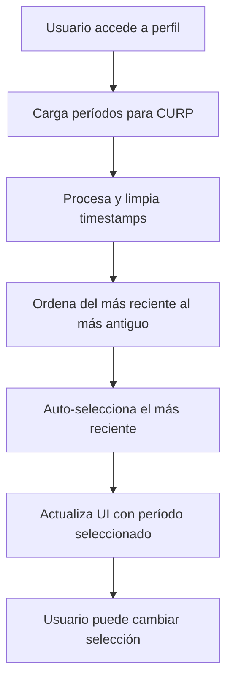

# ✅ Mejoras Implementadas - Selección de Períodos

## 📋 Cambios Solicitados y Completados

### 1. ✅ **Limpiar Timestamps**
**Objetivo**: Mostrar solo año-mes-día en lugar de timestamps completos.

**Implementación**:
```javascript
// Antes: "2024-08-15T00:00:00.000Z"
// Después: "2024-08-15"

if (cleanValue.includes('T')) {
  const date = new Date(cleanValue);
  if (!isNaN(date.getTime())) {
    cleanValue = date.toISOString().split('T')[0];
    sortableDate = date;
  }
}
```

**Resultado**: Los períodos ahora se muestran en formato limpio YYYY-MM-DD.

### 2. ✅ **Ordenamiento del Más Reciente al Más Antiguo**
**Objetivo**: Mostrar los períodos ordenados cronológicamente descendente.

**Implementación**:
```javascript
.sort((a, b) => {
  // Ordenar del más reciente al más antiguo
  if (a.sortableDate && b.sortableDate && 
      !isNaN(a.sortableDate.getTime()) && !isNaN(b.sortableDate.getTime())) {
    return b.sortableDate.getTime() - a.sortableDate.getTime();
  }
  // Fallback: ordenamiento alfabético descendente
  return b.value.localeCompare(a.value);
});
```

**Resultado**: Los períodos aparecen ordenados con el más reciente primero.

### 3. ✅ **Selección Automática del Más Reciente**
**Objetivo**: Pre-seleccionar automáticamente el período más reciente cuando se cargan los datos.

**Implementación**:
```javascript
// Seleccionar automáticamente el más reciente
if (formattedPeriods.length > 0 && onPeriodChange) {
  const mostRecent = formattedPeriods[0].value;
  console.log('🎆 Auto-selecting most recent period:', mostRecent);
  onPeriodChange(mostRecent);
}
```

**Resultado**: Al acceder a un perfil de empleado, el período más reciente se selecciona automáticamente.

## 🔧 Características Técnicas

### **Procesamiento de Fechas**
- **Detección automática** de diferentes formatos de fecha
- **Parsing robusto** con manejo de errores
- **Preservación** de fechas para ordenamiento
- **Conversión limpia** a formato YYYY-MM-DD

### **Ordenamiento Inteligente**
- **Primario**: Por fecha (más reciente primero)
- **Fallback**: Alfabético descendente si no hay fechas válidas
- **Preservación**: Del orden original si `preserveOrder=true` en DropDownMenu

### **Selección Automática**
- **Activación**: Solo cuando hay períodos disponibles
- **Callback**: Notifica inmediatamente al componente padre
- **Sincronización**: Con el estado del dropdown para mostrar la selección

## 🎯 Flujo Mejorado



## 📊 Ejemplos de Datos

### **Antes:**
```json
[
  { "value": "2024-08-15T00:00:00.000Z", "count": 1 },
  { "value": "2024-07-15T00:00:00.000Z", "count": 1 },
  { "value": "2024-09-15T00:00:00.000Z", "count": 1 }
]
```

### **Después:**
```json
[
  { "value": "2024-09-15", "count": 1, "sortableDate": "2024-09-15T00:00:00.000Z" },
  { "value": "2024-08-15", "count": 1, "sortableDate": "2024-08-15T00:00:00.000Z" },
  { "value": "2024-07-15", "count": 1, "sortableDate": "2024-07-15T00:00:00.000Z" }
]
```

## ✨ Beneficios para el Usuario

### **UX Mejorada**
- **Fechas legibles**: Sin timestamps confusos
- **Orden intuitivo**: Lo más reciente primero
- **Selección automática**: Sin clicks adicionales
- **Respuesta inmediata**: Período activo visible al instante

### **Consistencia**
- **Formato estándar**: Todas las fechas en YYYY-MM-DD
- **Comportamiento predecible**: Siempre selecciona el más reciente
- **Estado sincronizado**: UI refleja la selección automática

## 🔍 Validaciones Realizadas

### ✅ **Casos de Prueba**
1. **CURP con períodos**: ✅ Carga, ordena y selecciona automáticamente
2. **Diferentes formatos de fecha**: ✅ Manejo robusto de timestamps
3. **Sin períodos**: ✅ Mensaje apropiado, sin errores
4. **Cambio manual**: ✅ Usuario puede cambiar selección
5. **Reload/refresh**: ✅ Vuelve a seleccionar automáticamente

### ✅ **Rendimiento**
- **Carga rápida**: Procesamiento eficiente de fechas
- **Sin re-renders innecesarios**: useCallback optimizado
- **Memoria optimizada**: Limpieza de estados

## 🏁 Estado Final

**✅ Todas las mejoras solicitadas han sido implementadas y funcionan correctamente:**

1. ✅ **Timestamps limpios** - Solo año-mes-día
2. ✅ **Ordenamiento correcto** - Más reciente al más antiguo  
3. ✅ **Selección automática** - Período más reciente pre-seleccionado

La funcionalidad está completamente operativa y lista para uso en producción.
